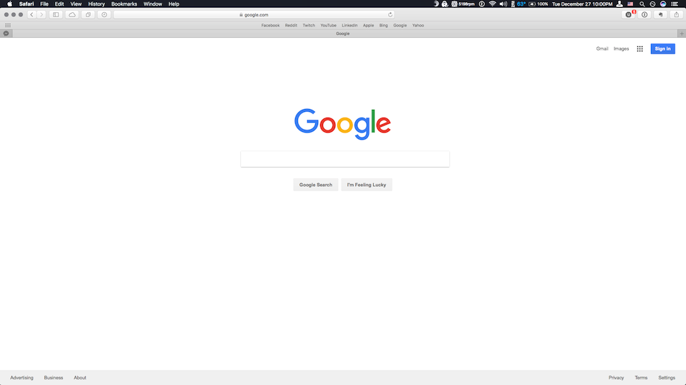
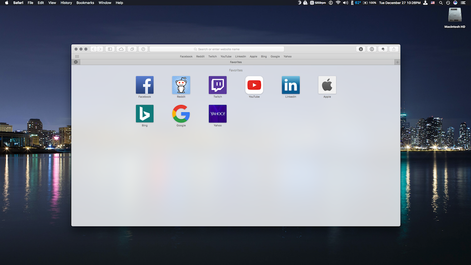
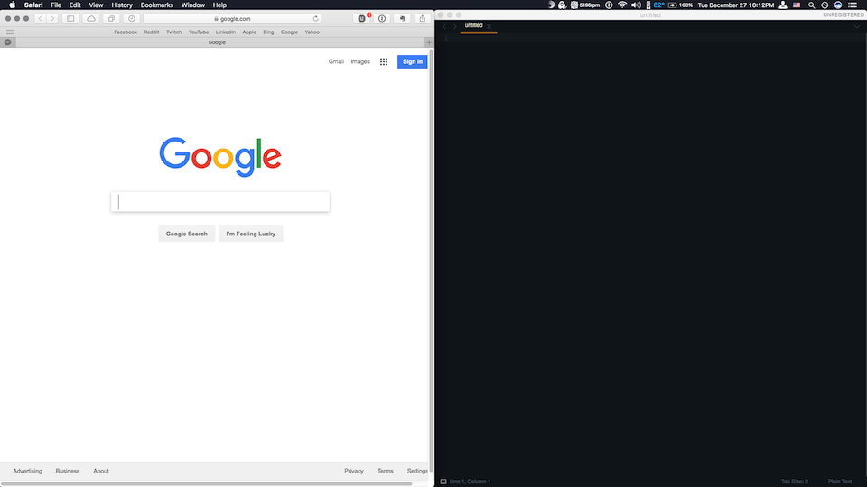
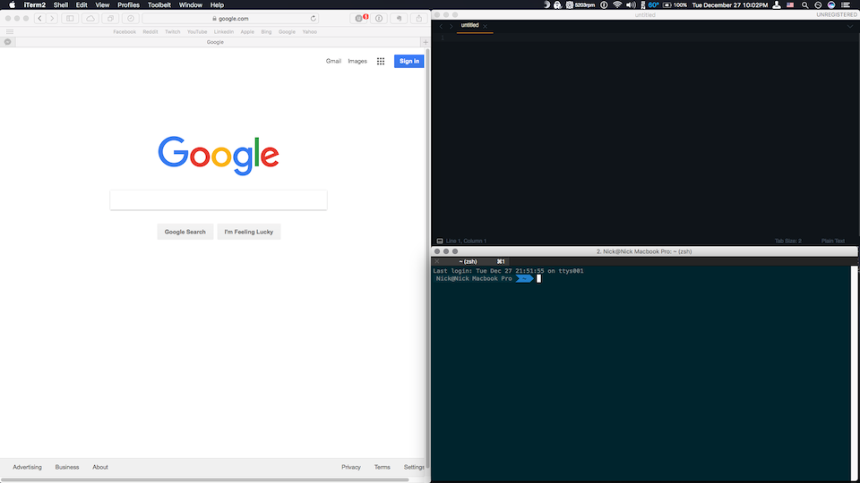
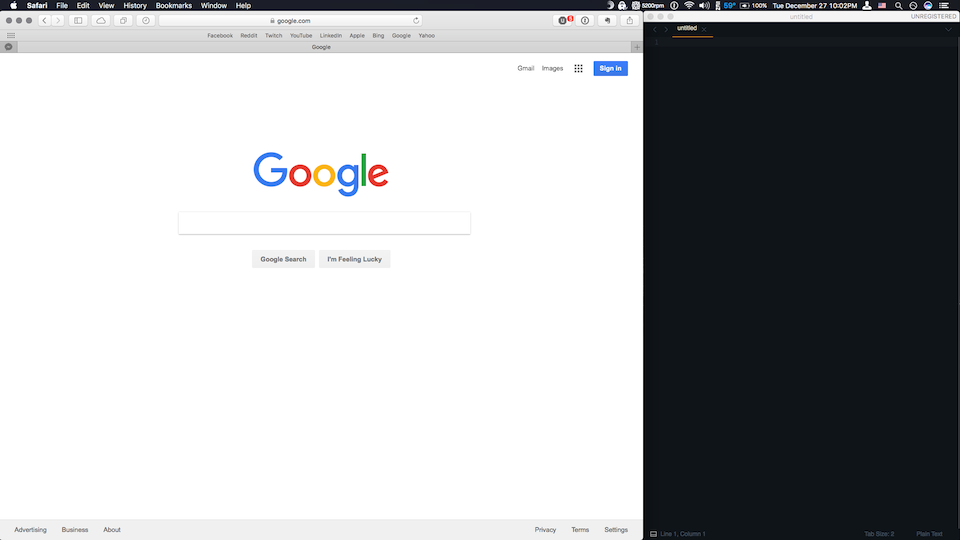

### Configuration Files
Configuration files used to set up helpful tools on my macbook.

#### Table of Contents
1. __Homebrew__
  * Brew
  - Homebrew Bundle
2.  __Slate__
  - Modifiers
3. __iTerm 2__

# Homebrew

> The missing package manager for macOS :beer:
> ###### [http://brew.sh/](http://brew.sh/)
> ###### [https://github.com/Homebrew](https://github.com/Homebrew)

#### Brew
###### [https://github.com/Homebrew/brew](https://github.com/Homebrew/brew)
Install Homebrew by simply entering the following command in the terminal.

`/usr/bin/ruby -e "$(curl -fsSL https://raw.githubusercontent.com/Homebrew/install/master/install)"`

#### Homebrew Bundle
###### [https://github.com/Homebrew/homebrew-bundle](https://github.com/Homebrew/homebrew-bundle)

The `Brewfile` configuration file contains brew commands for all formulae. Brewfiles are created by and can be restored with the `homebrew-bundle` package.

*Easily access homebrew-bundle with* `brew tap Homebrew/bundle`

# Slate

> Slate is a window management application similar to Divvy and SizeUp (except better and free!). Originally written to replace them due to some limitations in how each work, it attempts to overcome them by simply being extremely configurable. As a result, it may be a bit daunting to get configured, but once it is done, the benefit is huge.
> ###### [https://github.com/jigish/slate](https://github.com/jigish/slate)

The `.slate` file is used to configure window management. Slate looks for the configuration file in the Home Directory (`~ or /Users/[User]`).

The current slate configuration (December 2016) uses several modifier key combinations with the arrow keys to manage windows.

#### Modifiers

| Modifier | Description | Screenshot |
|---|---|---|
| `cmd` + `up arrow` | The current window fills the screen. |  |
| `cmd` + `down arrow` | The current window centers on the screen. |  |
| `cmd` + `left/right arrow key` | The current window snaps in the direction of the arrow key pressed and fills 50% of the screen. |  |
| `cmd` + `shift` + `arrow key` | The current window snaps to a corner and fills 25% of the screen. |  |
| `ctrl` + `option` + `left/right arrow key` | The current window snaps in the direction of the arrow key pressed and fills 67% of the screen. |  |
| `ctrl` + `option` + `cmd` + `left/right arrow key` | The current window snaps in the direction of the arrow key pressed and fills 33% of the screen. | See above. |

# iTerm 2

> iTerm2 is a replacement for Terminal and the successor to iTerm. It works on Macs with macOS 10.8 or newer. iTerm2 brings the terminal into the modern age with features you never knew you always wanted.
> ###### [https://www.iterm2.com/](https://www.iterm2.com/)
> ###### [https://github.com/gnachman/iTerm2](https://github.com/gnachman/iTerm2)

The configuration file (`com.googlecode.iterm2.plist`) is loaded from the path specified in the `iTerm2 -> Preferences -> General Tab`.

